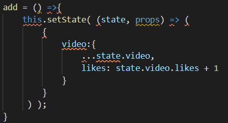
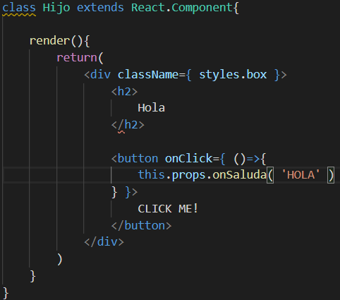
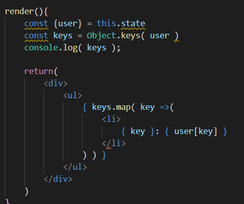

# 1-Fundamentos de las herramientas de desarrollo :orange_book:

Veremos herramientas utiles para el desarrollo con **REACT** como **NPM**, **BABEL**, **WEBPACK** aunque tambien
se utilizaran 

## Entorno de desarrollo de REACT JS

Se puede implementar **REACT** utilizando la libreria sin compilar pero lo mas recomendado es utilizar
**JSX** el cual es un lenjuage compilado.
Para la implementacion de **REACT** se utilizara el modulo *create-react-app*.

## Explicacion de NPM, Webpack y babel

**NPM**: Es un gestor de modulos de JS.

**BABEL**: Es un traductor de codigo JS con estandares nuevos, lo que permite que el projecto sea
utilizable en cualquier navegador, aunque este no soporte los ultimos estandares del **ecmascript**.

**WEBPACK**: Permite ulizar modulos para reutilizar codigos, es muy util utilizarlo junto con **BABEL**.

## Chrome DevTools

Para abrir las **DevTools** se utiliza *ctrl+shift+i*.

Las **DevTools** posee  una *consola* la cual permite una interaccion
entre el programa y el navegador.

## Creando Stack con REACT

Para crear una app de **REACT** utilizamos el comando **CREATE-REACT-APP *nombre app***, este comando puede ser instalado con **NPM**.

## Comandos utiles

* **NPM START**: Ejecuta la aplicacion en un servidor local.
* **NPM RUN**: 

## Estructura del proyecto

Dentro de la carpeta **public** se encuentra el **INDEX.html** en el cual se puede encontrar un *div* de clase *root* que en donde se generara nuestra aplicacion. 
El archivo **manifest.json** se encuentra las cosas necesarias para realizar una **PWA**.

Dentro de la carpeta **src** se encuentran todos los archivos de la aplicacion
, en el **Index.js** se encuentra importa el modulo *serviceWorker* junto con el archivo **serviceWorker.js** se utiliza
para generar una **PWA**.

# 2-Introduccion REACT CORE

Esta seccion permite comprender el entorno de **REACT**, y todo su entorno como **JSX** y las **expresiones** las cuales permiten generar codigo *html* de forma de reutilizar codigo. 
Junto con la aplicacion de codigo de **CSS** para mejor las paginas web.

Los temas vistos en esta seccion son:

1. Introduccion a JSX
2. Componentes
3. JSX en profundidad
4. Ecmascript 6
5. Manejo de Eventos
6. Extras

## Introduccion a JSX

**JSX** es una combinacion entre **JS** y **HTML** la cual permite indexar directamente **HTML** en codigo **JS**.

### Creacion de elementos e insercion en el DOM

Utilizar **REACT** debo importar el modulo ***React*** y ***ReactDOM***.

### Expresiones

Para insertar una expresion en **JSX**, utilizando llaves, dentro de ellos puedo colocar cualquier expresion valida de **JS**.

## Componentes

Los componentes permiten la reutilizacion de codigo
. Existen 2 grandes grupos de componentes los **FUNCIONALES** y 
**BASADOS EN CLASES**. Los mas recomendables para 
utilizar son los componentes **FUNCIONALES** ya que necesitan
menor cantidad de lineas de codigo gracias a los **HOOKS**.

### Funcionales
Son funciones que retornan una unica etiqueta de **HTML**. Para 
llamar un componente un funcional se debe utilizar la nomenclatura clasica de **HTML**.

### Props

Las **props** son variables de entrada de los componentes,
los componentes que se le pasan a un **props** se deben utilizar
llaves aunque para los datos de tipo **String** son opcionales.

### Clases
Son clases que extienden de **React.Component** y debe implementar 
un metodo **render** el cual renderiza el componente.

Los componentes basados en clases soportan una actualizacion dinamica, utilizando una variable de clase **state** y para actulizar el componente se
utiliza el metodo *setState*. 

**ACLARACION**: Para los metodos que utilicen **this** es recomendable utilizar
el metodo **bind( this )** para todos los metodos que lo requieran.
Es recomendable utilizar inicializadores de propiedades.

#### Inicializadores de Propiedades

Se crea un atributo fuera del constructor y permite presindir del mismo
ya que la unica llamada necesaria es la del constructor del padre.

## Factorizacion de componentes

Es muy recomendable tener los componentes separados en diferentes carpetas, para lograr tener el codigo mucho mas ordenado.

## JSX en profundidad

Los componentes deben comenzar con mayuscula, ya que sino **Babel** no tomara como valido.

Para agregar una clase a una etiqueta se utiliza **className**.

**JSX** permite declarar modulos de componentes, es decir, es posible 
crear objetos **JSON** donde cada atributo sea un componente.

## CSS en React

Para indexar codigo **CSS** debo colocar el atributo **style** y pasar
como argumento un objeto que contenga las propiedades.

Si el estilo posee un gion medio (-) se utiliza la notacion **camelCase**.
**JSX** permite la implementacion de operadores ternarios dentro de los objetos, lo cual hace mucho mas sencilla la implementacion
de estilos segun los estados.

### CSS utilizando clases

Es recomendable utilizar dentro de cada carpeta del componente
sus estilos, lo que permite tener componentes aun mas modularizados.
**JSX** permite importar archivos **CSS** directamente, esto sucede gracias
al paquete de **WebPack**.

### Sistemas de Modulos

Cuando se desea utilizar un sistema de modulos de **CSS** el arvhivo debe ser nombrado de la siguiente forma:

***nombre*.modules.css**

## Ecmascript 6

### Object.assing() :+1:

Este metodo sirve para combinar objetos, pero si existe una coincidencia entre los atributos de los objetos
estas seran sobreescritas por la ultima encontrada.
La solucion de este problema puede es utilizar el metodo **Assing** sobre los atributos que se pisan creando un objetonuevo dentro de ese atributo.

### Operador Spread [ *...* ] 

Cuando poseo objetos dentro de objetos se utiliza el operador
**Spread**. El cual remplaza al metodo **Assing** con una sintaxis mucho mas amigable.

EL operador **spread** sirve para concatenar **arrays** de una forma muy util

#### Pasando props con Spread

Podemos utilizar el operador **Spread** para pasar parametros a los componetes de la forma:

 
### Mutacion de componenetes utilizando funciones

Debido a que el metodo **setState** es asincrono es muy util utilizar una funcion de callback dentro del
metodo.

## Manejo de eventos

### Eventos de Mouse
Exiten varios tipos de eventos de *Mouse* utiles cuando se desea utilizar **REACT**,
algunos de ellos son:

* onClick
* onMouseDown
* onMouseUp
* onMouseMove
  
Para mayor informacion se recomienda ir a la pagina oficial de **REACT**.

### Eventos tipo Input
Las etiquetas de **Input** poseen eventos muy utiles como:

* onChange
* onPaste
* onCopy

Los cuales ayudan a manejar la web de forma dinamica.

### Crear eventos personalizados en REACT

**REACT** permite crear eventos personalizados, lo que hasta ahora lo hemos visto como **props** aunque ahora podremos pasar 
informacion de un componente padre a un componente hijo y viceversa.

En el componenete padre utilizamos:

Mientras que en el componente hijo se utiliza

## Extras

### Inyectando HTML en componentes

Si bien esta practica esta desaconsejada, en algunas ocasiones puede ser util
esto se logra utilizando el atributo ***dangerouslySetInnerHTML*** y pasandole un **JSON** con el atributo **__html**.

### Prop especial childen

Si se desea utilizar etiquetas dentro de elementos componentes se puede utilizar la **prop** **children**, para ello
es necesatrio abrir y cerrar la etiqueta del componente.

### Destructuracion avanzada

La destructuracion nos permite que el codigo sea mucho mas legible, y menos confuso.

Es valido utilizar valores por defecto y destructuracion concatenada

### Elementos sin etiquetas con *fragment*

El **fragment** es una etiqueta de **REACT** que permite omitir la envoltura de etiquetas en los componentes,
las formas de utilizar esta etiqueta son:

### Portals

Los portals permiten renderizar etiquetas en otra etiqueta que no se **root**, lo cual es muy
util a la hora de hacer modals.

Para utilizar el modal debo llamar el componenete en mi **App.js**.

**ACLARACION: SE DEBE CREAR UN DIV CON EL ID *modal-root*, pues**
**REACT no es magico.**

### Control de datos de entrada

Para utilizar el control de datos es necesario utilizar el modulo **PropTypes** de **JS**, el cual se puede instalar con
**NPM** mediante el comando **npm i prop-types**.

Cuando se desea utilizar el control de datos, se debe implementar de la forma:

Donde en este caso **Profile** es un componente basado en clases, pero la nomenclatura para componentes **funcionales** es la misma.

### Datos de entrada por defecto

Como es posible la comprobacion de datos, tambien se puede definir valores por defecto a las **props**,
implementacion es identica a la de las **proptypes**, con la unica diferencia que debo llamar el atributo
**defaultProps**

# 3-Iterando Listas

En este apartado se tratara el tema de **iteradores**, ya sea sobre **arrays**, **JSON arrays** y **JSON**.

1. Iteracion de Arrays
2. Iterando propiedades de JSON
3. Propiedad KEY
4. Informacion de los datos iterados

## Iteracion de Arrays

Para iterar un array en **REACT** se hace uso del metodo ***map*** que poseen los arrays, y junto con la notacion
de **JSX** se retorna un elemento **HTML**.

**ACLARACION: los arrays pueden contener objetos tales como los JSON.**

## Iternado propiedades de JSON

Para iterar las **keys** de un objeto **JSON** se debo implementar de la siguiente forma:

## Propiedad KEY

Al recorrer **Array** es necesario definir un atributo **key** a las etiqueas, es muy recomendable utilizar el atributo
**ID** que viene de la base de datos. 

El beneficio de esta implementacion es que permite que el navegador renderice aquellos elementos que han mutado.

## Informacion de los datos iterados

Para pasar informacion del dato iterado se puede utilizar el metodo **bind** y pasarle como parametros **this** y **DATO**.

# 4- Entendiendo las Refs

Las **REFS** son referencias en el **DOM**, que vienen a remplazar los metodos clasicos de **JS**, como
> document.getElementById() 

entre otros.

