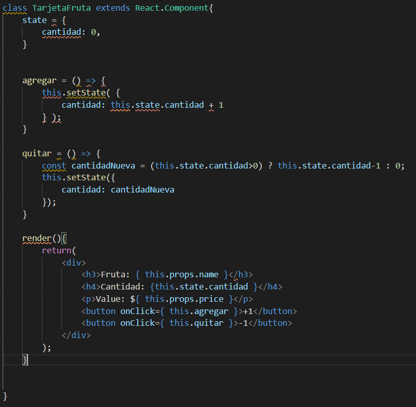
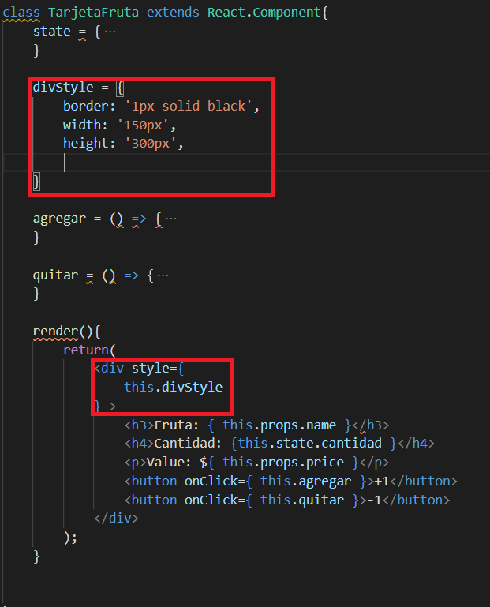
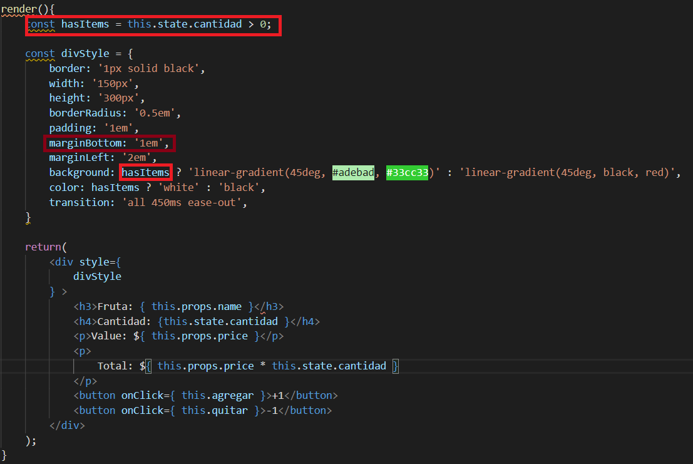
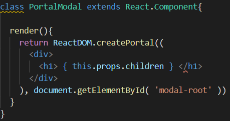
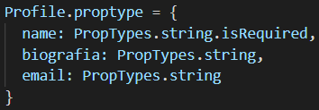
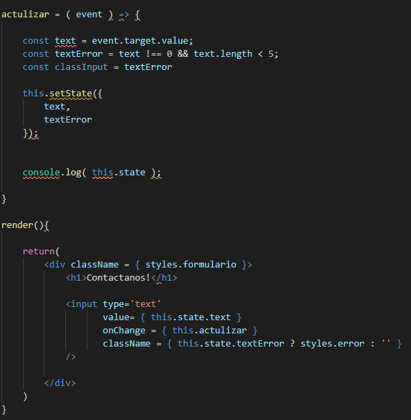
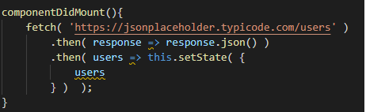
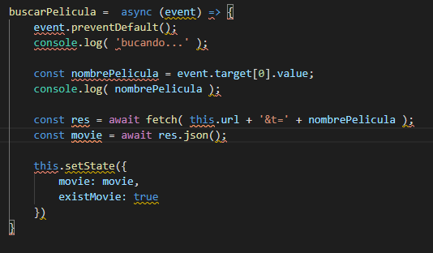
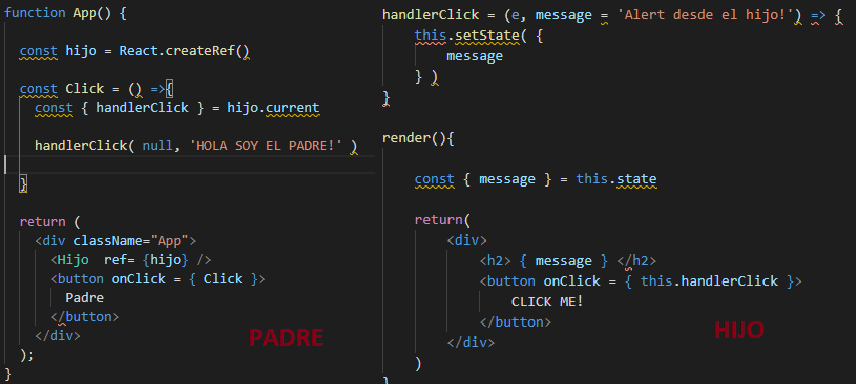
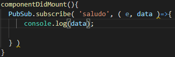

# 1-Fundamentos de las herramientas de desarrollo :orange_book:

Veremos herramientas utiles para el desarrollo con **REACT** como **NPM**, **BABEL**, **WEBPACK** aunque tambien
se utilizaran 

## Entorno de desarrollo de REACT JS

Se puede implementar **REACT** utilizando la libreria sin compilar pero lo mas recomendado es utilizar
**JSX** el cual es un lenjuage compilado.
Para la implementacion de **REACT** se utilizara el modulo *create-react-app*.

## Explicacion de NPM, Webpack y babel

**NPM**: Es un gestor de modulos de JS.

**BABEL**: Es un traductor de codigo JS con estandares nuevos, lo que permite que el projecto sea
utilizable en cualquier navegador, aunque este no soporte los ultimos estandares del **ecmascript**.

**WEBPACK**: Permite ulizar modulos para reutilizar codigos, es muy util utilizarlo junto con **BABEL**.

## Chrome DevTools

Para abrir las **DevTools** se utiliza *ctrl+shift+i*.

Las **DevTools** posee  una *consola* la cual permite una interaccion
entre el programa y el navegador.

## Creando Stack con REACT

Para crear una app de **REACT** utilizamos el comando **CREATE-REACT-APP *nombre app***, este comando puede ser instalado con **NPM**.

## Comandos utiles

* **NPM START**: Ejecuta la aplicacion en un servidor local.
* **NPM RUN**: 

## Estructura del proyecto

Dentro de la carpeta **public** se encuentra el **INDEX.html** en el cual se puede encontrar un *div* de clase *root* que en donde se generara nuestra aplicacion. 
El archivo **manifest.json** se encuentra las cosas necesarias para realizar una **PWA**.

Dentro de la carpeta **src** se encuentran todos los archivos de la aplicacion
, en el **Index.js** se encuentra importa el modulo *serviceWorker* junto con el archivo **serviceWorker.js** se utiliza
para generar una **PWA**.

# 2-Introduccion REACT CORE

Esta seccion permite comprender el entorno de **REACT**, y todo su entorno como **JSX** y las **expresiones** las cuales permiten generar codigo *html* de forma de reutilizar codigo. 
Junto con la aplicacion de codigo de **CSS** para mejor las paginas web.

Los temas vistos en esta seccion son:

1. Introduccion a JSX
2. Componentes
3. JSX en profundidad
4. Ecmascript 6
5. Manejo de Eventos
6. Extras

## Introduccion a JSX

**JSX** es una combinacion entre **JS** y **HTML** la cual permite indexar directamente **HTML** en codigo **JS**.

### Creacion de elementos e insercion en el DOM

Utilizar **REACT** debo importar el modulo ***React*** y ***ReactDOM***.

### Expresiones

Para insertar una expresion en **JSX**, utilizando llaves, dentro de ellos puedo colocar cualquier expresion valida de **JS**.

## Componentes

Los componentes permiten la reutilizacion de codigo
. Existen 2 grandes grupos de componentes los **FUNCIONALES** y 
**BASADOS EN CLASES**. Los mas recomendables para 
utilizar son los componentes **FUNCIONALES** ya que necesitan
menor cantidad de lineas de codigo gracias a los **HOOKS**.

### Funcionales
Son funciones que retornan una unica etiqueta de **HTML**. Para 
llamar un componente un funcional se debe utilizar la nomenclatura clasica de **HTML**.

### Props

Las **props** son variables de entrada de los componentes,
los componentes que se le pasan a un **props** se deben utilizar
llaves aunque para los datos de tipo **String** son opcionales.

### Clases
Son clases que extienden de **React.Component** y debe implementar 
un metodo **render** el cual renderiza el componente.

Los componentes basados en clases soportan una actualizacion dinamica, utilizando una variable de clase **state** y para actulizar el componente se
utiliza el metodo *setState*. 

**ACLARACION**: Para los metodos que utilicen **this** es recomendable utilizar
el metodo **bind( this )** para todos los metodos que lo requieran.
Es recomendable utilizar inicializadores de propiedades.

#### Inicializadores de Propiedades

Se crea un atributo fuera del constructor y permite presindir del mismo
ya que la unica llamada necesaria es la del constructor del padre.

## Factorizacion de componentes

Es muy recomendable tener los componentes separados en diferentes carpetas, para lograr tener el codigo mucho mas ordenado.

## JSX en profundidad

Los componentes deben comenzar con mayuscula, ya que sino **Babel** no tomara como valido.

Para agregar una clase a una etiqueta se utiliza **className**.

**JSX** permite declarar modulos de componentes, es decir, es posible 
crear objetos **JSON** donde cada atributo sea un componente.

## CSS en React

Para indexar codigo **CSS** debo colocar el atributo **style** y pasar
como argumento un objeto que contenga las propiedades.

Si el estilo posee un gion medio (-) se utiliza la notacion **camelCase**.
**JSX** permite la implementacion de operadores ternarios dentro de los objetos, lo cual hace mucho mas sencilla la implementacion
de estilos segun los estados.

### CSS utilizando clases

Es recomendable utilizar dentro de cada carpeta del componente
sus estilos, lo que permite tener componentes aun mas modularizados.
**JSX** permite importar archivos **CSS** directamente, esto sucede gracias
al paquete de **WebPack**.

### Sistemas de Modulos

Cuando se desea utilizar un sistema de modulos de **CSS** el arvhivo debe ser nombrado de la siguiente forma:

***nombre*.modules.css**

## Ecmascript 6

### Object.assing() :+1:

Este metodo sirve para combinar objetos, pero si existe una coincidencia entre los atributos de los objetos
estas seran sobreescritas por la ultima encontrada.
La solucion de este problema puede es utilizar el metodo **Assing** sobre los atributos que se pisan creando un objetonuevo dentro de ese atributo.

### Operador Spread [ *...* ] 

Cuando poseo objetos dentro de objetos se utiliza el operador
**Spread**. El cual remplaza al metodo **Assing** con una sintaxis mucho mas amigable.

EL operador **spread** sirve para concatenar **arrays** de una forma muy util

#### Pasando props con Spread

Podemos utilizar el operador **Spread** para pasar parametros a los componetes de la forma:

 
### Mutacion de componenetes utilizando funciones

Debido a que el metodo **setState** es asincrono es muy util utilizar una funcion de callback dentro del
metodo.

## Manejo de eventos

### Eventos de Mouse
Exiten varios tipos de eventos de *Mouse* utiles cuando se desea utilizar **REACT**,
algunos de ellos son:

* onClick
* onMouseDown
* onMouseUp
* onMouseMove
  
Para mayor informacion se recomienda ir a la pagina oficial de **REACT**.

### Eventos tipo Input
Las etiquetas de **Input** poseen eventos muy utiles como:

* onChange
* onPaste
* onCopy

Los cuales ayudan a manejar la web de forma dinamica.

### Crear eventos personalizados en REACT

**REACT** permite crear eventos personalizados, lo que hasta ahora lo hemos visto como **props** aunque ahora podremos pasar 
informacion de un componente padre a un componente hijo y viceversa.

En el componenete padre utilizamos:

Mientras que en el componente hijo se utiliza

## Extras

### Inyectando HTML en componentes

Si bien esta practica esta desaconsejada, en algunas ocasiones puede ser util
esto se logra utilizando el atributo ***dangerouslySetInnerHTML*** y pasandole un **JSON** con el atributo **__html**.

### Prop especial childen

Si se desea utilizar etiquetas dentro de elementos componentes se puede utilizar la **prop** **children**, para ello
es necesatrio abrir y cerrar la etiqueta del componente.

### Destructuracion avanzada

La destructuracion nos permite que el codigo sea mucho mas legible, y menos confuso.

Es valido utilizar valores por defecto y destructuracion concatenada

### Elementos sin etiquetas con *fragment*

El **fragment** es una etiqueta de **REACT** que permite omitir la envoltura de etiquetas en los componentes,
las formas de utilizar esta etiqueta son:

### Portals

Los portals permiten renderizar etiquetas en otra etiqueta que no se **root**, lo cual es muy
util a la hora de hacer modals.

Para utilizar el modal debo llamar el componenete en mi **App.js**.

**ACLARACION: SE DEBE CREAR UN DIV CON EL ID *modal-root*, pues**
**REACT no es magico.**

### Control de datos de entrada

Para utilizar el control de datos es necesario utilizar el modulo **PropTypes** de **JS**, el cual se puede instalar con
**NPM** mediante el comando **npm i prop-types**.

Cuando se desea utilizar el control de datos, se debe implementar de la forma:

Donde en este caso **Profile** es un componente basado en clases, pero la nomenclatura para componentes **funcionales** es la misma.

### Datos de entrada por defecto

Como es posible la comprobacion de datos, tambien se puede definir valores por defecto a las **props**,
implementacion es identica a la de las **proptypes**, con la unica diferencia que debo llamar el atributo
**defaultProps**

# 3-Iterando Listas

En este apartado se tratara el tema de **iteradores**, ya sea sobre **arrays**, **JSON arrays** y **JSON**.

1. Iteracion de Arrays
2. Iterando propiedades de JSON
3. Propiedad KEY
4. Informacion de los datos iterados

## Iteracion de Arrays

Para iterar un array en **REACT** se hace uso del metodo ***map*** que poseen los arrays, y junto con la notacion
de **JSX** se retorna un elemento **HTML**.

**ACLARACION: los arrays pueden contener objetos tales como los JSON.**

## Iternado propiedades de JSON

Para iterar las **keys** de un objeto **JSON** se debo implementar de la siguiente forma:

## Propiedad KEY

Al recorrer **Array** es necesario definir un atributo **key** a las etiqueas, es muy recomendable utilizar el atributo
**ID** que viene de la base de datos. 

El beneficio de esta implementacion es que permite que el navegador renderice aquellos elementos que han mutado.

## Informacion de los datos iterados

Para pasar informacion del dato iterado se puede utilizar el metodo **bind** y pasarle como parametros **this** y **DATO**.

# 4- Entendiendo las Refs

Las **REFS** son referencias en el **DOM**, nos permiten utilizar metodos de las etiquetas **HTML** tales como
**FOCUS** o **BLUR**.

Para implementar accesos al **DOM** existe la opcion de utilizar las **REFS** con el metodo:

> this.refs_name.current

## Envio de la prop especial ref con *forwardref*

Con el metodo **forwardref** puedo enviar una **REF** de un componente padre a un componente hijo, con la salvedad de que el hijo debe 
ser funcional.

# 5- Formularios

Existen 2 formas de obtener informacion de **inputs** en **REACT**, las cuales son:

## Inputs no controlados

1- Utilizando **REFS** es los inputs
2- Utilizando una etiqueta **form** y en el metodo que llame la accion **onSubmit** usar el **event** 
para acceder a los diferentes inputs.

### Ventajas

* Codigo facil de crear
* Muy similar a codigo **HTML**

### Desventajas

* no permite la validacion mientras la informacion cambia

## Inputs controlados

Los inputs controlados se pueden implementar mediante:

El uso de la variable **state**.

## Etiquetas de Formularios

### Select
Esta etiqueta permite que la seleccion de una lista de opciones, para leer el valor obtenido
es recomendable utilizar inputs controlados.

### Checkbox
Permite seleccionar una propiedad, por ejemplo, si el usuario desea recibir emails. Se utiliza igual que cualquier input controlado.

# 6- Debugging

## Chrome Dev Tools
Chrome posse una extension de **REACT** la cual hace mas sencillo el debugging de las webs con este framework.

Esta herramienta incluye 2 nuevas ventanas a la herramienta de inspeccion de chrome, las cuales son **components** y **profile**.

### Components

Muestra los componentes incluidos en la web, muy parecido a la inspeccion de elementos, pero separado por componentes.

### Profiler

Permite crear perfiles de lo que sucede en un determinado tiempo del componente, analizando el tiempo que tarda el componente en actulizarce.

## Manejo y limite de errores dentro de componentes

**REACT** permite utilizar un metodo llamador **componentDidCatch** el cual se puede implementar en cualquier componenete y 
permite mostrar una vista alternativa cuando sucede un error. Es recomendable
implementar una clase que maneje lo errores y que renderice a los elementos hijos cuando todo anda bien y cuando no, renderice una
vista personalizada.

Este metodo puede tener dos parametros de entrada:
1- **error**: contiene el tipo de error.
2- **errorInfo**: contiene la descripcion del error.

# 7- Solicitudes HTTP 

Si bien **REACT** no posee modulos propios para las solicitudes **HTTP** es posible utilizar distintos metodos para
la implementacion de dichas peticiones.

## Peticiones Fetch

Una forma de realizar peticiones **HTTP** es utilizar la funcion **fetch**, la cual proviene de JS vanilla, debemos recordar que la misma
devuelve una promesa, por lo tanto se debe utilizar el metodo **then** para obtener los resultados.

## Peticiones con Axios

Axios es una libreria de **JS** que permite dar soporte a navegador antiguos.

## Async y Await para solicitudes HTPP

Las sentencias **async** y **await** permiten hacer que el codigo asincrono parezca codigo sincrono, esperando
una respuesta del servidor antes de seguir ejecutar ciertas lineas de codigo.

# 8- Metodos de los ciclos de vida de los componentes

Los metodos de ciclos de vida son solo validos en componentes basados en clases, para componentes
funcionales existen los **HOOKS**, los cuales se veran en otra seccion.

## Constructor

Es el primer metodoen ejecutarse, y sirve para preestablecer valores del estado o para pasar el contexto adecuado
a un metodo, utilizando **bind**, o crear las **refs** necesarias.

## Render

Es el encargado de renderizar el componente, y es el unico metodo obligatorio que debemos implementar **siempre**, como lo hemos venido haciendo
a lo largo de este curso.

## componentDidMount

Se ejecuta luego del render, durante el montaje, y es un excelente lugar para realizar solicitudes HTTP

## componentDidUpdate

Es un metodo identico al anterior solo que se ejecuta cada vez que sucede una actualizacion, es decir,
cuando se ejecuta un cambio en el **state** del componente, un cambio en las **props** recibidas
o cuando se fuerza la actulizacion del componenete.

Este metodo es util para realizar solicitudes **HTTP** que dependan de alguna **prop**.

**DATO: el metodo puede recibir como primer dato las props previas y como segundo dato las nuevas props, lo cual**
**es util para ahorrar datos a la hora de hacer solicitudes HTTP.**

## getSnapshotBeforeUpdate

Se ejecuta inmediatamente luego del render y antes de actualizar el **DOM**, lo cual nos permite capturar
datos del **DOM** antes de su actualizacion.

El valor que retorna este metodo llega al metodo componentDidUpdate.

## getDeliveryStateFromProps

Es muy poco frecuente la implementacion de este metodo **estatico**, por lo cual no se puede acceder a propiedades del componente
, su utilidad principal es actualizar al **props** de forma dinamica, como entrada posee **nextProp** y el **prevState**.

Este metodo debe retornar un **JSON** el cual se mezclara con el **state** actual.

## shouldComponentUpdate

Se ejecuta antes del render y decide si el render se realizara o no. Este metodo debe retornar si o si un valor booleano, ya que
sino **REACT** marcara un error.

Es usual utilizar este metodo para optimizar el rendimiendo de la web app, renderizando solo los elementos que cambian entre 
las diferentes actulizaciones.

## PureComponent

Es una clase que permite realizar lo mismo que **shouldComponentUpdate**, este es util para implementar en componentes
que se vayan a utilizar para iteraciones.

**ACLARACION: toda clase que herede de PureComponent solo realizara comparariones de propiedades de 1er nivel, si alguna propiedad es un JSON que**
**tiene otro JSON indexado la actualizacion sera erronea.**

## componentWillUnmount

Es el unico metodo se aplica cuando el componente es destruido. Y se utiliza para limpiar **timers**, **listeners** o **metodos del padre**.

# 9- Composicion y comunicacion entre componentes

En este apartado se vera en profundidad las diferentes formas de comunicacion entre componentes, comenzando desde las mas sencillas
como **Padre-Hijo** e **Hijo-Padre** hasta algunas mas complejas como comunicaciones entre cualquier componente sin import su gerarquia.

## Comunicacion Padre - Hijo

Es posible utilizar los metodos declarados en **Hijo** ingresano una **ref** desde el componente **padre** al componente **Hijo**, lo cual
tambien nos permite hacer mutaciones el el **Hijo**

## Comunicacion Hijo - Padre

Debido a como es el manejo del **DOM** y los eventos es posible realizar una comunicacion **Hijo** **Padre** utilizando el mismo evento
en ambos y para mandar informacion al evento, al cual llamaremos **e** se le agrega un atributo el cual subira en la jerarquia de eventos.

**ACLARACION: gracias a esto es posible realizar comunicacion ñieto abuelo, o desde componentes inferiores a componentes de mayor jerarquia.**

Esta practica es desaconsejable ya que existen dos flujos dentro de la aplicacion.

## Comunicacion Hermanos

Para comunicar hermanos se debe implementar una **prop** que sea afectada por uno de ellos y el otro pueda observarla, es decir,
cuando yo haga click en un boton dicho evento debe afectar la **prop** que recibe alguno de sus hermanos.

## Observar Pattern

Para lograr comunicacion entre cualquierar componente a cualquier componente, sin importar cual sea su orden gerarquico,
para ello se debe utilizar alguna libreria que permita dicha implementacion, la mas conocida a dia de hoy es **PubSub**.

La libreria **PubSub** nos permite mediante el metodo **publish** publicar un evento, tal como se muetras a continuacion:

Por otro lado para escuchar el evento se debe utilizar el metodo **suscribe** es en componente que deseemos que escuche
dicho evento:

Es importar desuscribirse cuando el componenete sea destruido, utilizando el metodo **unsuscribe**.

## Variables globales

Es posible utilizar comunicacion entre componenetes mediante contamienacion de variables globales.
esta practica es desaconsejada, pero puede servir para aplicaciones de prueba.

## Comunicacion con API Context

El **API Context** es una **API** de **REACT** que permite la comunicacion de componentes, mediante un objeto,
el cual genera los componentes **Provider** el cual posee un atributo **value** que le envia al componente **hijo** que 
desee recibirlo, y otro componente **Consumer** el cual obtiene los datos.

**Consumer** recibe por primer valor una funcion que optiene el atributo **value**.
